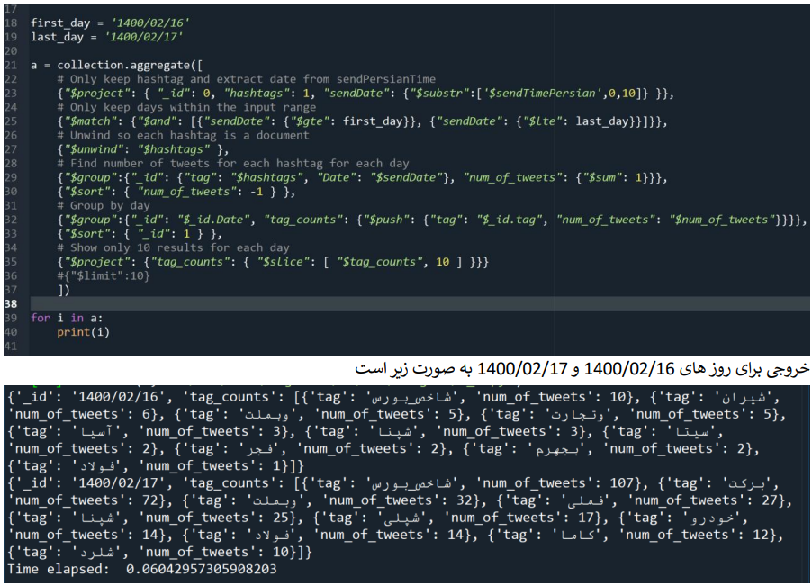
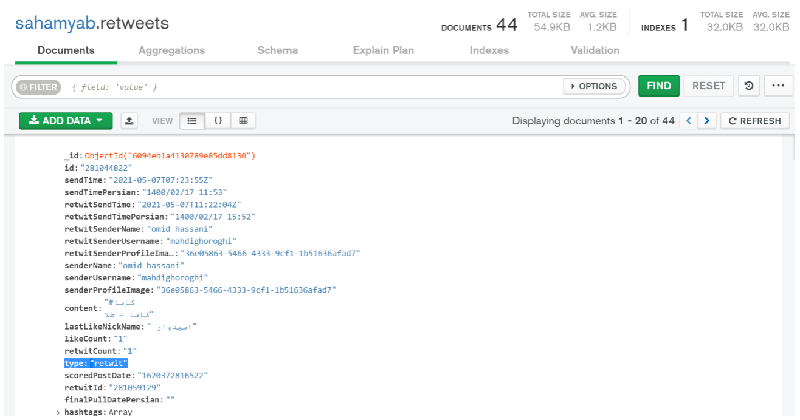
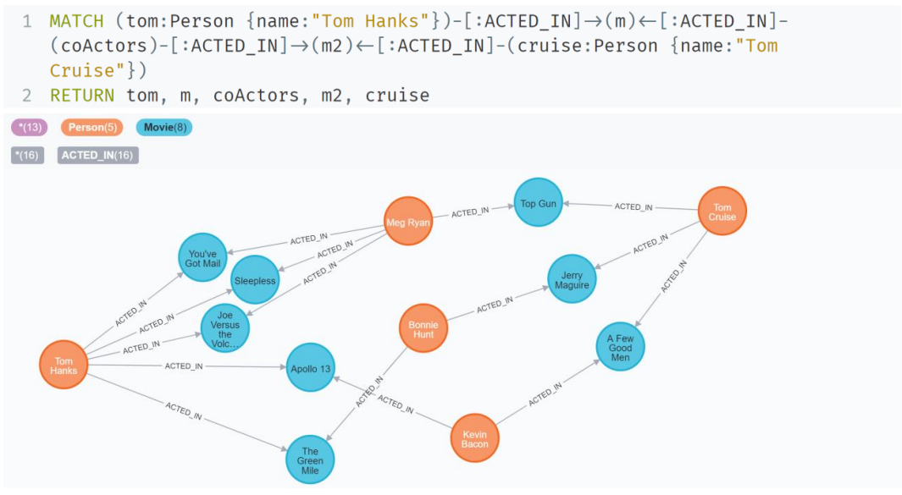
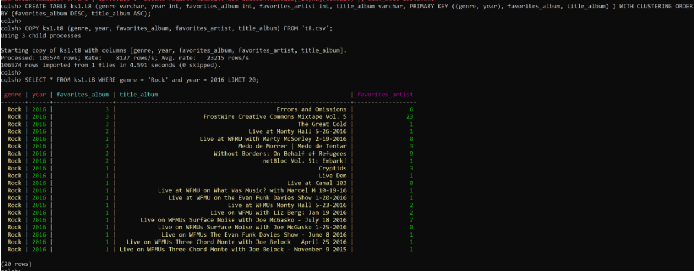
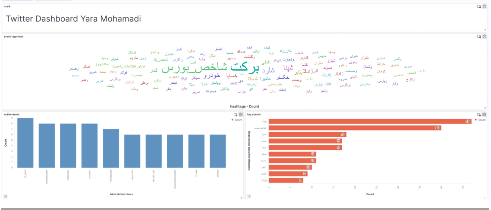

This is a collection of queries and analytics for some NoSQL Databases (***MongoDB***, ***Neo4j***, ***Cassandra***, and ***Elasticsearch***).

## MongoDB
Database creation and Queries for crawled stock trades from [Sahamyab](https://www.sahamyab.com/), a smart investment network in Iran.

#### Sample query:

#### MongoDB Compass sample report:

## Neo4j

After creating Nodes for the Movies dataset, I wrote queries in `Cypher` to extract relevant data from created graphs for each query.

#### Sample query:

- `Actors who have worked with Tom Hanks and Tom Cruise`

actors_worked_with_tom_hanks.png

## Cassandra
Queries for Free Music Archive (FMA). As we don't have joins in Cassandra, I've created a special table for each requested query and after loading the table's data.

#### Sample query:

- `Show 20 rock songs from 2016`

## Elasticsearch
Queries for crawled data from crawled stock trades from [Sahamyab](https://www.sahamyab.com/). And creating a management dashboard with Kibana.

#### Sample query:

#### Sample dashboard:

