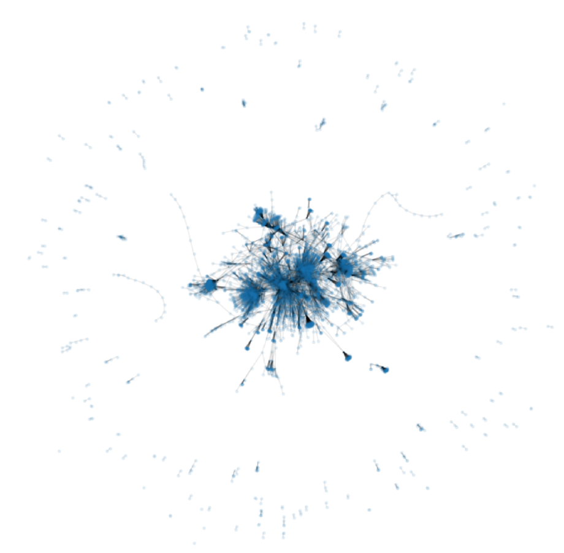

# Using Apache Spark for NLP, Log mining, Stock and Graph tasks

## Decription:

In this project, I've used Apache Spark for text analysis, Log mining, Stock market analysis and Wikipedia graph based analysis.

## Basic Spark for text analysis
I first counted and displayed the number of words in some textbook files. I also reported how often each word was repeated and saved the output to a .txt file. All punctuation marks (exclamation marks, question marks, periods, etc.) were removed. Finally, I created the `bigram` of the prepared dataframe and computed the count of each bigram.

## LogFile Mining with Spark
The log file I used contained HTTP requests. This file was explored using the basic commands of Spark, SQL Spark, and Dataframes Spark.

## Stock Market Analysis with Spark
In this task, I analyzed and performed some queries on the stock market data of Iran during the last 6-months using Spark, SQL Spark, and Dataframes Spark.

## Wikipedia analysis with GraphX
I performed some queries using GraphX for graph data in this task. The graphs were extracted from [Wikipedia](https://www.wikipedia.org/) articles where each node represented an article and an edge from article A to article B indicated that article A referred to article B. The complete graph can be seen in the figure below:

